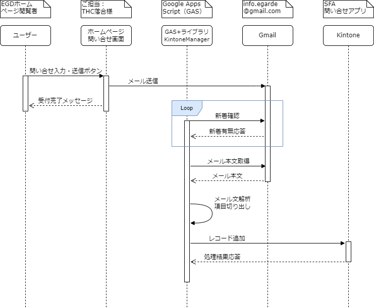

<!-- omit in toc -->
# HP問い合せkintoneアプリ変更要領


## 1. 目次

- [1. 目次](#1-目次)
- [2. 概要](#2-概要)
- [3. システムの仕組み](#3-システムの仕組み)
  - [3.1. 処理シーケンス](#31-処理シーケンス)
  - [3.2. ページ項目一覧](#32-ページ項目一覧)
  - [3.3. メール文](#33-メール文)
  - [3.4. Googleスクリプト](#34-googleスクリプト)
- [4. 変更内容](#4-変更内容)
  - [4.1. Kintoneフォーム](#41-kintoneフォーム)
  - [4.2. Googleスクリプト](#42-googleスクリプト)
- [5. その他特記事項・備考](#5-その他特記事項備考)
- [6. 改訂履歴](#6-改訂履歴)

## 2. 概要

- 現在当社ホームページの問い合せページから入力・送信された情報は、自動的に社内システムのKintoneアプリ（SFA問い合わせアプリ）に登録される仕組みになっている。
- 今回ホームページの全面リニューアルに伴い、問い合せページから送信されるデータ項目も変更されることとなる。これにより既存のKintoneアプリならびにKintoneへの登録スクリプトの変更が必要となるため、以下にその変更要領を説明する。

## 3. システムの仕組み

### 3.1. 処理シーケンス
ホームページ問い合せ内容がKintoneアプリに登録される仕組みは下記の方法で実現している。




### 3.2. ページ項目一覧
新旧のホームページ問い合せページとメール文の項目名、ならびにKintoneフォームとの対応は以下の通り。

| 新規 | 旧HP | 新HP | メール項目名 |> |> |> | kintoneフィールド |
| :---: | --- | --- | --- | --- | --- | --- | --- |
|  |  |  |  | フィールド名 | フィールドコード | フィールドタイプ | 備考 |
| | ― | ― | ― | 問合せId | レコード番号 | RECORD_NUMBER | ― |
| | ― | ― | ― | 対応状況 | ドロップダウン | DROP_DOWN | 未対応 , 対応不要 , 対応中 , 完了 |
| | ― | ― | ― | 問い合せソース | source2 | DROP_DOWN | 問電話,問HP |
| | ― | ― | ― | 対応担当者 | 対応担当者 | USER_SELECT | ― |
| | 会社名 | 会社名 / 個人 | 会社名 | 顧客名 | corp | SINGLE_LINE_TEXT | ― |
| | ご担当者名 | お名前（姓 / 名） | ご担当者名 | ご担当者名 | sur | SINGLE_LINE_TEXT | ― |
| | ご担当者名フリガナ | お名前（セイ / メイ） | ご担当者名フリガナ | ご担当者名フリガナ | kana | SINGLE_LINE_TEXT | ― |
| | ― | ― | （件名） | 件名 | subject | SINGLE_LINE_TEXT | メール件名 |
| | ご依頼内容 | お問い合わせ内容 | ご依頼内容 | ご依頼内容 | inquiry | SINGLE_LINE_TEXT | ― |
| | 電話番号 | 電話番号 | 電話番号 | 電話番号 | phone | SINGLE_LINE_TEXT | ― |
| | E-mail | メールアドレス | E-mail | E-mail | Email | SINGLE_LINE_TEXT | ― |
| | 郵便番号 | 郵便番号 | 郵便番号 | 郵便番号 | zipcode | SINGLE_LINE_TEXT | ― |
| | 都道府県 | 都道府県 | 都道府県 | 都道府県 | state | DROP_DOWN | 北海道,・・・,沖縄県 | 
| | 住所 | 市町村番地 | 住所 | 住所 | address | SINGLE_LINE_TEXT | ― |
| | 建物名 | マンション / ビル名 | 建物名 | 建物名 | building | SINGLE_LINE_TEXT | ― |
| | ― | ― | ― | 問い合せ商品 | 問い合せ商品 | SINGLE_LINE_TEXT | 手入力用| 
| | ― | ― | ― | 数量規模 | 数量規模 | SINGLE_LINE_TEXT | 手入力用| 
| | ― | ― | ― | 予算 | 予算 | SINGLE_LINE_TEXT | 手入力用| 
| | ― | ― | ― | ご利用用途 | use | SINGLE_LINE_TEXT | 手入力用| 
| | ― | ― | ― | 導入時期 | start | SINGLE_LINE_TEXT | 手入力用| 
| | お問い合わせ/ご相談内容 | お問い合わせ内容 | お問い合わせ/ご相談内容 | 詳細 | yourmessage | MULTI_LINE_TEXT | ― |
| | 関心のあるサービス | 気になる製品 | 関心のあるサービス | 関心のあるサービス | interest | SINGLE_LINE_TEXT | ― |
| | 弊社をお知りになったきっかけ | ― | 弊社をお知りになったきっかけ | 弊社をお知りになったきっかけ | how | SINGLE_LINE_TEXT | 新HPでは廃止されているが互換のため残しておく |
| 新規 | ― | 業種 | 業種 | 業種 | industry | SINGLE_LINE_TEXT | ― |
| 新規 | ― | URL | URL | URL | url | SINGLE_LINE_TEXT | ― |
| | ― | ― | ― | 送信元名 | name | SINGLE_LINE_TEXT | info@e-garde.co.jp（検証用） |
| | ― | ― | ― | 送信元メールアドレス | email | SINGLE_LINE_TEXT | info@e-garde.co.jp（検証用） |
| | ― | ― | ― | 添付ファイル | Attachment | FILE | 未使用 |
| | ― | ― | ― | 内容 | message | MULTI_LINE_TEXT | 元メール文を丸ごとセット（検証用） |


### 3.3. メール文
- メール文中に挿入される項目名は、新ホームページと旧ホームページとで同じ項目名を使用するようWEBサイト作成業者へ依頼している。

- 今回問い合わせページの仕様が変更されている項目については、下記要領でメール文にセットしてもらうよう依頼している。
  - ご担当者名
    - 姓と名の間に半角スペースを入れて結合する
  - ご担当者名フリガナ
    - 姓と名の間に半角スペースを入れて結合する
  - 業種
    - 業種と業種詳細の間に半角スペースを入れて結合する
  - 郵便番号
    - 間に半角ハイフンを入れて結合する
  - 関心のあるサービス
    - 検索ワードと製品名を半角アンダーバーで結合する
    - 複数製品選択された場合は全角読点(、)で連結する

- メール文サンプル
  > 　----------------------------------------------------------------
  > お問い合わせ内容
  > ご依頼内容：その他
  > ご担当者名：広瀬 羅貴
  > ご担当者名フリガナ：ヒロセ ラツキ
  > 会社名：株式会社イーガルド
  > 業種：製造業 半導体
  > URL：https://www.e-garde.co.jp/
  > 郵便番号：103-0006
  > 都道府県：東京都
  > 住所：中央区日本橋富沢町13-8
  > 建物名：大場ビル4F
  > 電話番号：03-3249-4556
  > E-mail：hiroser@e-garde.co.jp
  > 関心のあるサービス：リストバンド_クーバングルHF、リストバンド_クーバングルⅡ
  > お問い合わせ/ご相談内容：
  > 突然のご連絡大変失礼いたします。
  > この度、弊社と一緒にロボットを広めていく取り組みをしてくださる企業様を探> しております。
  > 一度弊社へお問い合わせいただけますと幸いです。
  > 以上、ご検討のほど何卒よろしくお願い申し上げます。
  > 　----------------------------------------------------------------
  > 

### 3.4. Googleスクリプト
最初に起動され関数 sendToKintone()これがいわばメインルーチン
トリガー設定で10分おきに起動される設定にしている
sendToKintone()の中でgetGmailMessage()を呼び出している。ここで新着メール（件名に「ホームページ」が含まれる）の有無を確認している。
getGmailMessage()で新着メールがある場合はメール文解析のルーチンlexicalAnalyzer()をコールしている。


## 4. 変更内容
### 4.1. Kintoneフォーム
- SFA問い合わせ管理アプリのフォームに下記のフィールドを追加する。
  - 業種
  - URL
- 下記フィールドはグループに入れるなどして退避させる。
  - 弊社をお知りになったきっかけ

詳細は[3.2. ページ項目一覧](#32-ページ項目一覧)を参照。
  

### 4.2. Googleスクリプト
- 追加となった２つの項目（業種とURL）に対する処理を追加する。
  - 変数宣言（30行目あたり）
    ```Javascript
    var strIndustry = '';
    var strUrl = '';
    ```
  - 変数へのセット（132行目あたり）
    ```Javascript
    case '業種':
      strIndustry = item_message;
      break;
    case 'URL':
      strURL = item_message;
      break;
    ```
  - JSON文字列へのセット（216行目あたり）
    ```Javascript
    records += ',' + Utilities.formatString('"industry" : { "value": "%s" }',strIndustry);
    records += ',' + Utilities.formatString('"url" : { "value": "%s" }',strUrl);
    ```

  
## 5. その他特記事項・備考
- テストのやり方


## 6. 改訂履歴
| 版 | 改訂日 | 改訂内容 | 担当 |
| --- | :---: | --- | :---: |
| 1.0 | 2022-11-25 | 初版作成 | 源内 |
|  |  |  |  |
|  |  |  |
